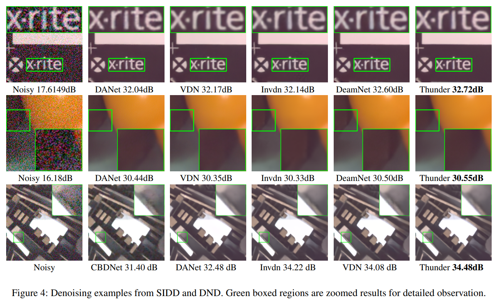
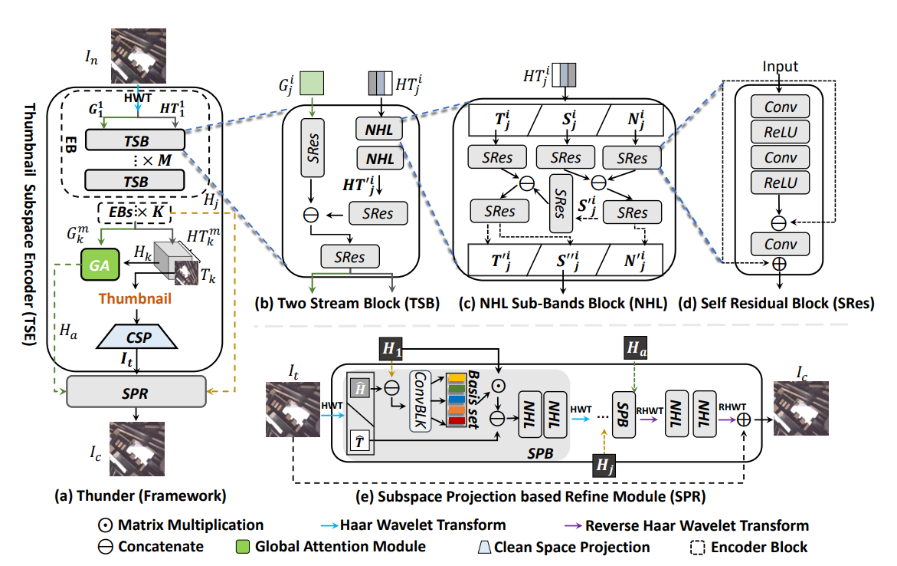
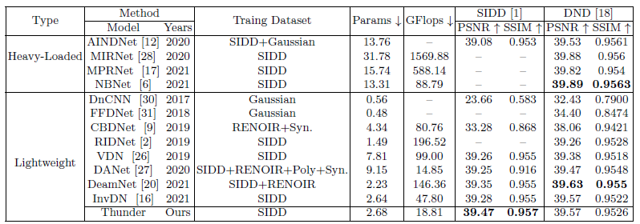

# Thunder
Thunder: Thumbnail based Fast Lightweight Image Denoising Network

The existing denoising methods aim to predict the **noisy residual**.
To achieve impressive results on real-world noise reduction, these models are designed in a **heavy-loaded way** so it's difficult to deploy them in practice.
It is challenging for noisy-residual-based methods to compress their models because the noisy features demand more channel numbers and filters.
To this end, we propose a **Thu**mb**n**ail based **De**noising Netwo**r**k dubbed Thunder to achieve fast lightweight restoration without compromising its denoising capabilities.
The proposed Thunder contains two novel modules: (1) a wavelet-based Thumbnail Subspace Encoder (TSE) which can leverage sub-bands correlation to provide an approximate thumbnail based on the low-frequent feature; (2) a Subspace Projection based Refine Module (SPR) which can restore the details for thumbnail progressively based on the subspace projection approach.

  
    

## Introduction
This is some source code and additional visualization examples of our **Thunder**.

**Motivation of Our Work**

The noise is uniformly distributed across the ambient space, while the noiseless images (signals) lie in a low-dimensional subspace because of the spatial correlation.
Based on this assumption, we assume that the complexity of modeling the noisy space is more than that of signal space.
The existing methods suffer from the huge computational costs because convolutional layers project the feature by exponentially increasing channel numbers ($3 \rightarrow 32 \dots \rightarrow 1024$).

To achieve fast lightweight denoising, we compress the feature subspace to a small RGB subspace: $\bm{T} \in \mathbb{R}^{\frac{H}{s}\times \frac{W}{s}\times 3}$, therefore, we can reduce a lot of computational costs by alleviating the channel numbers for all the convolutional layers.
However, this subspace cannot afford enough representation ability to compute the noisy residual because of the capability limitation of $\bm{T}$.
On the contrary, $\bm{T}$ is more likely to reconstruct the signal.
$\bm{T}$ not only can be regarded as the 3 channel RGB thumbnail for the clean image but also can be viewed as the low-frequency information of noisy images.
To take advantage of $\bm{T}$, we propose a signal-reconstruct manner and leverage fewer parameters and less computational cost to achieve the fast lightweight denoising.

**Insight of Our Work**
1. The proposed Thunder accelerates the denoising process based on the thumbnail subspace. This design significantly reduces the projection complexity without compromising its denoising capabilities.
2. The proposed Wavelet-based Thumbnail Subspace Encoder (TSE) can encode the noisy image to thumbnail space in terms of the sub-bands correlation.
3. The proposed Subspace Projection based Refine Module (SPR) which can reduce the noise while preserve the signal details thus refining the signal details for thumbnail.

  
    

## results
More quantity results can be found in `768-Supplementary Material.pdf`

    

